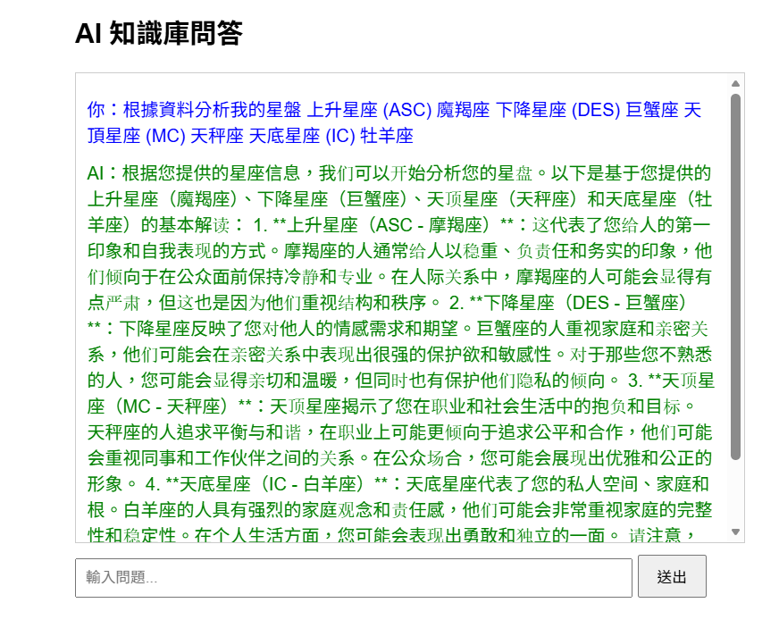

# AI Astrology RAG System

一個基於本地大語言模型的占星分析系統。
本專案使用 Retrieval-Augmented Generation (RAG) 架構，
結合占星書籍知識庫（約 35 萬字），提供語意問答與占星解析。

---

## 專案特色

* 完全本地運行（無需 OpenAI API）
* 使用占星專業書籍作為知識來源
* 支援語意搜尋與上下文理解
* 可擴展為完整星盤分析系統

---

## 技術架構

* **Ollama**：本地運行 LLM（qwen2.5:7b）
* **LangChain**：RAG pipeline 管理
* **ChromaDB**：向量資料庫（語意搜尋）
* **FastAPI**：提供 API 服務

---

## 系統流程

占星書籍 → 切分 → Embedding → 向量資料庫 →
語意搜尋 → LLM 生成占星解析

---

## 環境準備

### 1️⃣ 安裝 Ollama

下載並安裝：
https://ollama.com

啟動後拉取模型：

ollama pull qwen2.5:7b

---

## 如何啟動

### 1️⃣ 啟動 Ollama（一定要先）

ollama serve

（或開啟 Ollama 應用程式）

---

### 2️⃣ 安裝 Python 套件

pip install -r requirements.txt

---

### 3️⃣ 啟動 API

python -m uvicorn main:app --reload

---

### 4️⃣ 開啟 API 文件

http://127.0.0.1:8000/docs

---

## API 範例

GET /ask?question=根據資料分析我的星盤 上升星座 (ASC) 魔羯座 下降星座 (DES) 巨蟹座 天頂星座 (MC) 天秤座 天底星座 (IC) 牡羊座？

---

## 說明

本專案展示如何將通用 RAG 架構應用於特定領域（占星學），
並透過本地模型與知識庫提升回答品質與可解釋性。
